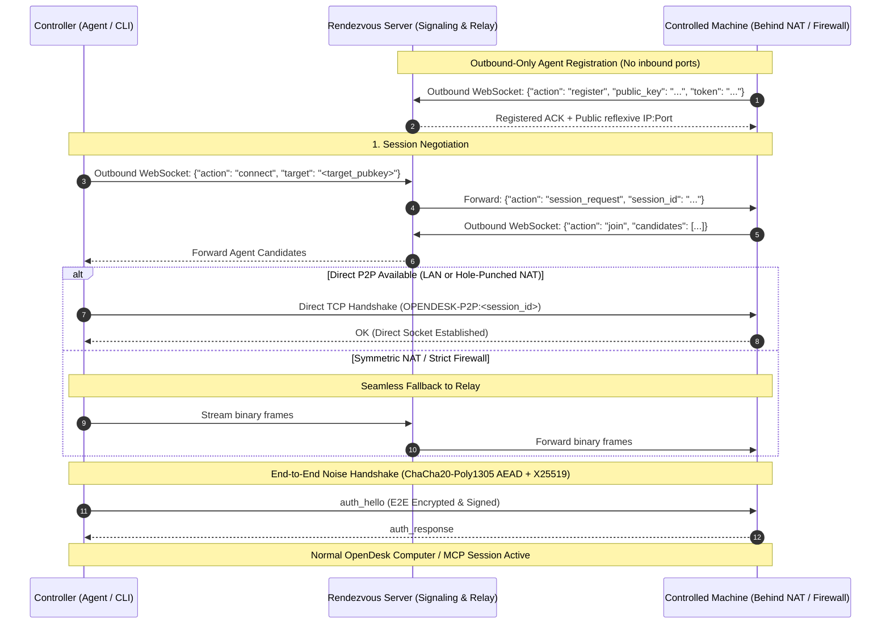

# Internet Remote Transport (Rendezvous & Relay)

Control any machine across the Internet — behind NATs, CGNAT, and corporate firewalls — with **zero inbound ports** open on the controlled machine.



---

## Core Capabilities

1. **Zero Inbound Ports (`--no-listen`)**:
   The controlled machine does not open any local listening TCP port. It initiates an outbound-only persistent WebSocket connection to your self-hosted rendezvous server.
2. **Direct P2P Traversal**:
   When host or reflexive candidates can reach each other (same LAN, port-mapped router, or hole-punchable NAT), the controller and controlled agent establish a direct TCP stream.
3. **Seamless Relay Fallback**:
   If direct connection is blocked by symmetric NATs or strict stateful firewalls, the rendezvous server acts as an opaque binary relay.
4. **End-to-End Encryption Preserved**:
   The Noise protocol (X25519 DH + ChaCha20-Poly1305 AEAD) operates end-to-end between controller and agent *over* the relay or direct socket. The relay forwards opaque ciphertext and cannot inspect keystrokes, display captures, or commands.
5. **Persistent Unattended Reconnection**:
   The controlled agent continuously monitors the rendezvous link and automatically reconnects with exponential backoff if the network or rendezvous server restarts.

---

## 1. Deploying the Rendezvous Server

The rendezvous service is lightweight, stateless in storage, and self-hosted with a single command:

```bash
opendesk rendezvous --host 0.0.0.0 --port 8424 --token "your-auth-token"
```

### Options

| Flag | Default | Description |
|---|---|---|
| `--host` | `0.0.0.0` | Bind IP interface |
| `--port` | `8424` | Listening port |
| `--token` | `None` | Optional pre-shared authentication token required by agents and controllers |
| `--log-file` | `None` | Path to append structured log entries |

Behind TLS reverse proxies (Caddy, Nginx, Cloudflare), terminate SSL at the proxy and point traffic to the rendezvous port:

```caddy
rendezvous.example.com {
    reverse_proxy localhost:8424
}
```

---

## 2. Controlled Machine Setup

### Running Outbound-Only

To run the controlled machine with no open listening ports:

```bash
opendesk serve \
  --no-listen \
  --rendezvous ws://rendezvous.example.com:8424 \
  --rendezvous-token "your-auth-token"
```

The server:
* Refuses to bind local TCP port 8420 (`listen=False`).
* Connects outbound to `rendezvous.example.com`.
* Registers its static public identity key.
* Awaits incoming session notifications.

### Persistent Unattended Service

To keep the controlled machine accessible 24/7 across reboots:

```bash
opendesk service install \
  --no-listen \
  --rendezvous ws://rendezvous.example.com:8424 \
  --rendezvous-token "your-auth-token"
```

This registers an OS-level daemon (systemd on Linux, launchd on macOS, or Windows Task Scheduler).

---

## 3. One-Time Pairing Across the Internet

Mutual trust is established using a 6-digit one-time code over the rendezvous channel:

1. **On the controlled machine**:
   ```bash
   opendesk pair 987654 \
     --rendezvous ws://rendezvous.example.com:8424 \
     --rendezvous-token "your-auth-token"
   ```
2. **On the controller machine**:
   ```bash
   opendesk pair-with 987654 \
     --rendezvous ws://rendezvous.example.com:8424 \
     --rendezvous-token "your-auth-token" \
     --name "cloud-vm"
   ```

Upon completion:
* The controlled machine saves the controller's public key in `~/.opendesk/trusted-peers.json`.
* The controller saves the controlled machine's public key and the `rendezvous_url` in its `trusted-peers.json`.
* Subsequent connections require no pairing codes.

---

## 4. Connecting to the Remote Machine

### Via CLI

Connect using the stored friendly name:

```bash
opendesk connect cloud-vm
```

Or query online registered devices:

```bash
opendesk discover --rendezvous ws://rendezvous.example.com:8424
```

Or connect directly by hex public key:

```bash
opendesk connect 7a3f89e1b2c4... --rendezvous ws://rendezvous.example.com:8424
```

### Via Python API

The `connect()` function transparently resolves stored rendezvous URLs:

```python
import asyncio
from opendesk.computer import Point, PointerAction, PointerEvent
from opendesk.remote.client import connect

async def main():
    # Resolves 'cloud-vm' from TrustedPeers, negotiates P2P or relay
    remote = await connect("cloud-vm")
    try:
        # Screen capture (E2E encrypted)
        pix = await remote.capture()
        print(f"Captured screen: {pix.width}x{pix.height}")

        # Cursor inspection & mouse move
        pos = await remote.cursor_position()
        print(f"Cursor currently at: ({pos.x}, {pos.y})")
        await remote.pointer(PointerEvent(action=PointerAction.MOVE, point=Point(x=100, y=200)))
    finally:
        await remote.aclose()

asyncio.run(main())
```

### Via MCP for AI Agents

Point Claude Code, Cursor, or any MCP client to the remote machine over the Internet:

```bash
opendesk mcp --target cloud-vm
```

Claude can now inspect, click, type, and automate the remote machine across the Internet without any port forwarding or VPNs.

---

## Security Model

* **Relay cannot eavesdrop**: Wire frames forwarded through the rendezvous server are ChaCha20-Poly1305 AEAD authenticated ciphertexts keyed by ephemeral session secrets derived from X25519 Diffie-Hellman.
* **Strict Mutual Authentication**: Unknown controllers are rejected before session dispatching occurs.
* **Single Controller Enforcement**: Controlled machines enforce single active controller locks to prevent conflicting inputs.
